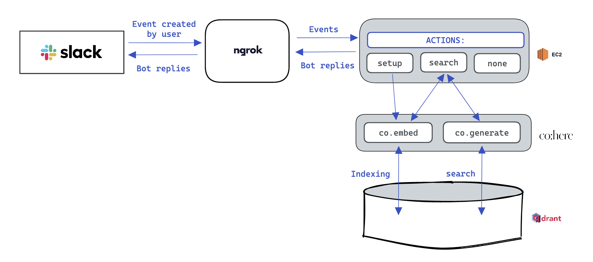

# Hai: Heuristic AI

## 1. Description and Demo in GIF
Heuristic enables users to ask questions in Slack/discord/teams and receive answers from all conversations within all channels. It utilizes a simple and intuitive way to search for answers and returns relevant responses quickly. With this app, you can easily access knowledge from your team and make informed decisions based on accurate information.

## 2. Architecture 🏗️

## 3. Tech stack 🏗️

- [x] **Cohere**: Generative [model](https://docs.cohere.ai/docs/generation-card) `command-xlarge-nightly` which allow us to extract the answer to the user's query from the extracted passage. We used Cohere also to  encode user conversation (embedding vectors).
- [x] **Qdrant**: The vector search engine (`1GB RAM - 0.5 vCPU - 20GB DISK`) that we have used after making a [benchmark](https://github.com/qdrant/vector-db-benchmark) of {Qdrant, Milvus, Faiss}. 
After 
the evaluation, Qdrant is the fastest way to search index and very easy to manipulate collections (intuitively).
- [x] **Slack_bolt**: It is a Python framework that makes it easier to build Slack apps with the platform's latest features. We could have been able to distribute the slack app (via OAuth & Permissions), but due to time constrains, the app is running on our [Heuristic AI Slack server](https://join.slack.com/t/heuristicai/shared_invite/zt-1reg204at-6BlH_V5E4r18BnpZX2JByA), you can join easily and test it features.
- [x] **Ngrok**: It is a simplified API that connects local wep appplication to the any cloud. It forward all user query to Amazon EC2 DNS's instance which make the text generation 🏗️
- [x] **Amazon EC2** (Free tier): Used to host the ngrok, and slack_app
    - Ubuntu 22.04 LTS
    - instance type: t2.micro
    - 1 Volume - 8 GiB
    - 1 GiB RAM
    - 64-bit (x86)

### How to use
If you want to test our app, you have to join our [slack server](https://join.slack.com/t/heuristicai/shared_invite/zt-1reg204at-6BlH_V5E4r18BnpZX2JByA). And if you find any issue to connect to our 
slack or not able to use our app, just leave an [issue](https://github.com/bm777/Heuristic/issues), within an hour, you will get a reply.

Due to the limited, we did get chance to prepare the distribution of our app and deploy on slack app directory for review, then the Slack's team has to verify and apporove our app if we respect the 
Terms and condition, and this verification process could take time, so we decide to allow user to join our workspace to test it.

The steps:

- Write and populate  slack channels {general, random or test} with the relavant information that you want the app to be able to retrieve, be imaginative. And following the structure of general message, then reply in thread.
- after populating, now, you must index all message just by asking our AI app called "hai", by the keyword setup: e.g.: "hai, start the setup". You should receive message Indexing done.
- Then now you can try to search following the structure: "hai, your-query"
- and you can stay in a channel, just ask a query it will dig into all slack channels and give the answer to you with exact location of the message.
- Just be innovative while searching, try to ask question in German and you will get the answer with the location of the message in the original language.

Search in Arabic giving the same result as in French and english

Search in Arabic

## Important
When you will do the <hai, setupt> process, make sure that the maximum of populated messages in slack are less than 100 messages, because we encode all messages (normal message with threads are considered also as a single message with its replies, no need to count them, we process them as a single). The maximum call of co.embed is 100 per minute (We used free trial key of COHERE), the we upsert all embedding in less than 10sec in qdrant.
